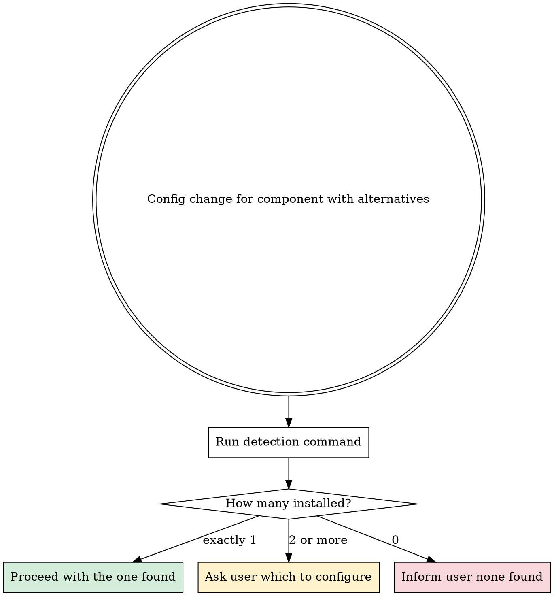

# Omarchy Alternatives

Omarchy has default components but users may install alternatives. Before modifying config for any component with known alternatives, detect what's installed and disambiguate.

## When to Trigger

Before modifying config for any component listed in the alternatives table below. This prevents configuring the wrong app or missing an app the user actually uses.

## Protocol

1. User asks to modify a component (e.g., "change app launcher settings")
2. Run the detection command for that function group
3. **Only one installed** → proceed, no question needed
4. **Multiple installed** → ask: "I detected [list]. Which should I configure? (a) Only [Omarchy default], (b) All of them, (c) A specific one"
5. **None installed** → inform user and suggest installing the Omarchy default

## Known Alternative Groups

| Function | Omarchy Default | Known Alternatives | Detection |
|----------|----------------|-------------------|-----------|
| App launcher | Walker | Rofi, Tofi, Wofi | `which walker rofi tofi wofi 2>/dev/null` |
| Terminal | (via `xdg-terminal-exec`) | Alacritty, Ghostty, Kitty, Foot, WezTerm | `which alacritty ghostty kitty foot wezterm 2>/dev/null` |
| Notification daemon | Mako | Dunst, SwayNotificationCenter | `which mako dunst swaync 2>/dev/null` |
| Status bar | Waybar | Eww, Yambar | `which waybar eww yambar 2>/dev/null` |
| File manager | Nautilus | Thunar, PCManFM, Nemo, Dolphin | `which nautilus thunar pcmanfm nemo dolphin 2>/dev/null` |
| Browser | (user's `$browser`) | Thorium, Firefox, Brave, Chromium, Chrome | `which thorium-browser firefox brave chromium google-chrome-stable 2>/dev/null` |
| PDF viewer | Evince | Zathura, Okular, Xournal++ | `which evince zathura okular xournalpp 2>/dev/null` |
| Image viewer | imv | feh, sxiv, loupe | `which imv feh sxiv loupe 2>/dev/null` |

## Omarchy-Specific Notes

- **Walker** is the Omarchy default launcher. Config: `~/.config/walker/config.toml`. Theme colors: `~/.config/omarchy/themes/$THEME_SLUG/walker.css`.
- **The active terminal** is whatever `xdg-terminal-exec` resolves to. Omarchy's terminal config integrates with the theme system for Alacritty, Ghostty, and Kitty (template-generated color configs).
- **Mako** is the Omarchy default notification daemon. Theme-integrated via `mako.ini` in the theme directory.
- **Omarchy themes only generate configs for their default components** (walker.css, mako.ini, terminal configs, etc.). Alternative apps (Rofi, Dunst, etc.) need manual theming — they won't pick up `colors.toml` changes automatically.

## Rules

- **ALWAYS run detection** before configuring a component with known alternatives.
- **NEVER assume** which app the user wants configured when multiple are installed. Ask.
- **Inform the user** when their chosen app is not theme-integrated (i.e., won't auto-update from `colors.toml`).
- If the user wants to change the Omarchy default app for a function, that's a separate concern — check Omarchy docs for how default apps are set (e.g., `xdg-terminal-exec`, `$browser` variable, Hyprland bindings).
