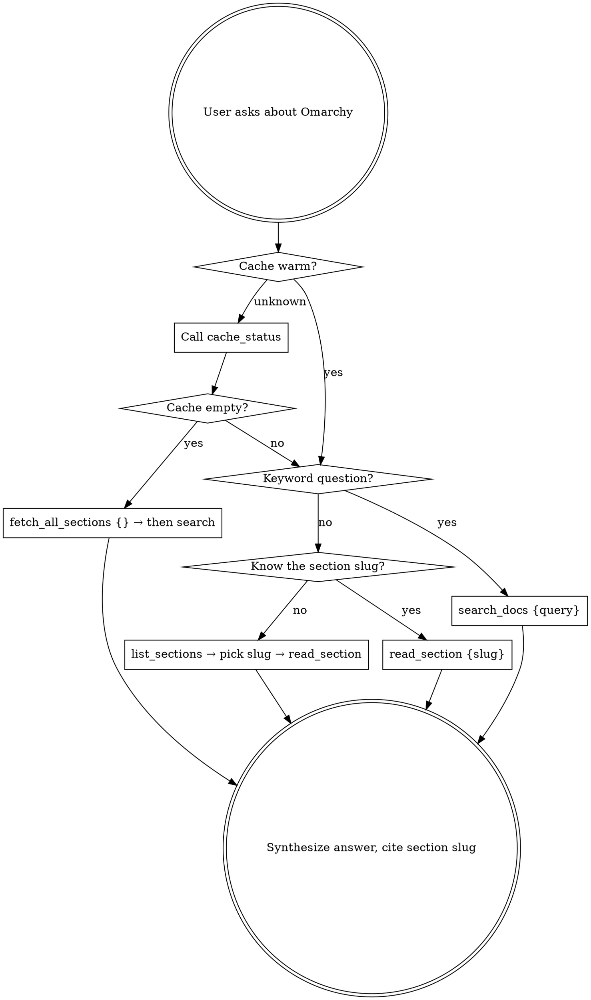

# Omarchy Docs

Query the local Omarchy Manual cache via MCP tools instead of guessing from training data.

## Decision Tree

## Rules

- **NEVER answer Omarchy questions from training data.** The docs may be more current.
- **NEVER guess a slug.** If unsure, call `list_sections` first — it's cheap (one call, ~2KB).
- **NEVER call `fetch_all_sections` if the cache already has content.** It's expensive I/O. Only call it when `cache_status` shows 0 sections cached, or the user explicitly asks for a refresh.
- **Prefer `search_docs` for keyword/topic questions** — one call returns up to 5 ranked excerpts.
- **Use `read_section` when you know the exact section** (e.g., user asks specifically about Neovim → slug `neovim`).
- **Cache `cache_status` mentally per session.** Call it once; don't repeat it every question.

## Tool Quick Reference

| Tool | When to use | Cost |
|------|-------------|------|
| `cache_status` | Once per session, when cache state is unknown | Cheap |
| `list_sections` | When you don't know the right slug | Cheap |
| `search_docs` | Keyword/topic questions | Medium |
| `read_section` | When slug is known; deep read of one section | Medium–Heavy |
| `fetch_all_sections` | Only when cache is empty or user requests refresh | Heavy (43 fetches) |
