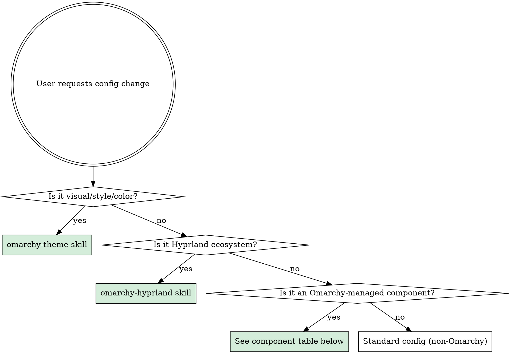

# Omarchy Env

Top-level environment navigator. Classifies config changes and routes to the correct skill to prevent wrong-layer edits.

## Step 0: Discover Environment (once per session)

Run these commands to establish context:

```bash
# Active theme slug
cat ~/.config/omarchy/current/theme.name

# Framework base path
echo ${OMARCHY_PATH:-~/.local/share/omarchy}

# Check if target file is a symlink (detect dotfiles repo)
readlink -f <target-file>
```

Cache these values mentally for the session. Do not re-run every question.

## Step 1: Classify the Change



### Category Definitions

| Category | Matches | Route to |
|----------|---------|----------|
| **A — Theme** | Colors, backgrounds, component styling, border colors, terminal colors, notification colors, bar opacity, accent color | `omarchy-theme` skill |
| **B — Hyprland** | Keybindings, monitors, input, window rules, animations, blur, opacity, tearing, idle, lock, sunset, autostart, env vars | `omarchy-hyprland` skill |
| **C — Omarchy component** | Waybar modules/layout, Walker behavior, Mako behavior, SwayOSD behavior, terminal behavior, btop config | See Component-to-File Mapping table below |
| **D — Non-Omarchy** | Neovim plugins, shell, git, tmux, Docker, editors | Standard config location |

**Gray zone — component COLORS vs component BEHAVIOR**: If the change is about colors/styling, it's Category A (theme) regardless of which component. If it's about behavior/layout/modules, it's Category C. Example: Waybar bar opacity = theme. Waybar module order = Category C.

## Step 2: Check for Alternatives

Before editing any component config, check if multiple apps serve the same function:
- **Invoke the `omarchy-alternatives` skill** if the component has known alternatives (launchers, terminals, notification daemons, browsers, file managers).
- If only one is installed, proceed. If multiple, ask the user.

## Step 3: Identify Correct File

### Component-to-File Mapping

| Component | Behavior config | Color/style config | Notes |
|-----------|----------------|-------------------|-------|
| **Hyprland** | `~/.config/hypr/*.conf` | Theme's `hyprland.conf` | See `omarchy-hyprland` skill for the config chain |
| **Hyprlock** | `~/.config/hypr/hyprlock.conf` | Theme's `hyprlock.conf` | Sources theme colors at top of file |
| **Hypridle** | `~/.config/hypr/hypridle.conf` | — | No theme dependency |
| **Hyprsunset** | `~/.config/hypr/hyprsunset.conf` | — | No theme dependency |
| **Waybar** | `config.jsonc` (modules, order, settings) + `style.css` (fonts, spacing, sizing) | Theme's `waybar.css` | **Split-layer warning below** |
| **Walker** | `~/.config/walker/config.toml` | Theme's `walker.css` | Search providers, behavior |
| **Mako** | `~/.config/mako/config` | Theme's `mako.ini` | Check `readlink -f` first — may be symlink |
| **SwayOSD** | System config | Theme's `swayosd.css` | Behavior mostly via CLI flags |
| **Terminals** | `~/.config/<terminal>/` per terminal | Theme's `alacritty.toml`, `ghostty.conf`, `kitty.conf` | Only Omarchy-default terminals get theme integration |
| **btop** | `~/.config/btop/btop.conf` | Theme's `btop.theme` | Theme sets color scheme |

All "Theme's X" entries are at `~/.config/omarchy/themes/$THEME_SLUG/X` — use `omarchy-theme` skill to edit them.

### Waybar Split-Layer Warning

Waybar is the most error-prone component because its config spans **3 files in 2 ownership domains**:

1. **Theme's `waybar.css`** — Color definitions (`@define-color`), bar background opacity. Managed by theme system.
2. **`~/.config/waybar/style.css`** — Font, spacing, sizing. **Line 1 imports theme colors** via `@import`. NEVER remove this import. NEVER put color changes here.
3. **`~/.config/waybar/config.jsonc`** — Modules, order, position, height, module settings.

Decision: colors/opacity → `omarchy-theme` skill. Fonts/spacing → `style.css`. Modules/structure → `config.jsonc`.

### Symlink Detection

Before editing any file:

```bash
readlink -f <file>
```

If the resolved path is inside `~/.config/omarchy/current/theme/` — **STOP**. That file is auto-generated. Edit the source in the user theme directory instead.

### NEVER-EDIT Zones

| Path | Why |
|------|-----|
| `~/.local/share/omarchy/` | Pacman-managed framework files. Overwritten on update. |
| `~/.config/omarchy/current/theme/` | Auto-generated by `omarchy-theme-set`. Overwritten on every theme apply. |
| Any symlink pointing into `current/theme/` | Same as above — edit the theme source instead. |

## Step 4: Fetch Docs

For upstream documentation on the component being modified:

```
# Context7 protocol
mcp__context7__resolve-library-id { "libraryName": "<component>" }
mcp__context7__query-docs { "libraryId": "<id>", "topic": "<specific topic>" }

# Omarchy Manual
Use omarchy-docs MCP tools (search_docs, read_section)
```

## Step 5: Post-Modification

| Change type | Action required |
|-------------|----------------|
| Theme file (`colors.toml`, theme CSS, etc.) | `omarchy-theme-set "$(cat ~/.config/omarchy/current/theme.name)"` |
| Hyprland conf (`~/.config/hypr/*.conf`) | Auto-reloads (Hyprland watches these files) |
| Waybar config/style | `omarchy-restart-waybar` |
| Mako config | `omarchy-restart-mako` |
| SwayOSD config | `omarchy-restart-swayosd` |
| Walker config | `omarchy-restart-walker` |
| Terminal config | `omarchy-restart-terminal` |
| btop config | `omarchy-restart-btop` |

## Step 6: Commit Protocol

```bash
# Find the repo root for the file you edited
git -C "$(dirname "$(readlink -f <file>)")" rev-parse --show-toplevel
```

- **Verify** the repo root is the EXPECTED repository before committing.
- If the file is symlinked from a dotfiles repo, commit in the dotfiles repo.
- If the file is in `~/.config/omarchy/themes/`, check if that directory is git-tracked or symlinked.
- **NEVER** commit to a nested clone, framework repo, or wrong repo by accident.

## Rules

- **ALWAYS discover the environment** (Step 0) before making any Omarchy config change.
- **ALWAYS classify** the change before touching files. The category determines the skill and the correct file.
- **NEVER edit files in NEVER-EDIT zones.** If `readlink -f` points there, find the real source.
- **NEVER hardcode paths** with `/home/<user>/`. Use `$HOME`, `~`, `$OMARCHY_PATH`, or dynamic discovery.
- **ALWAYS verify repo root** before committing. Wrong-repo commits are the most common and most damaging mistake.
