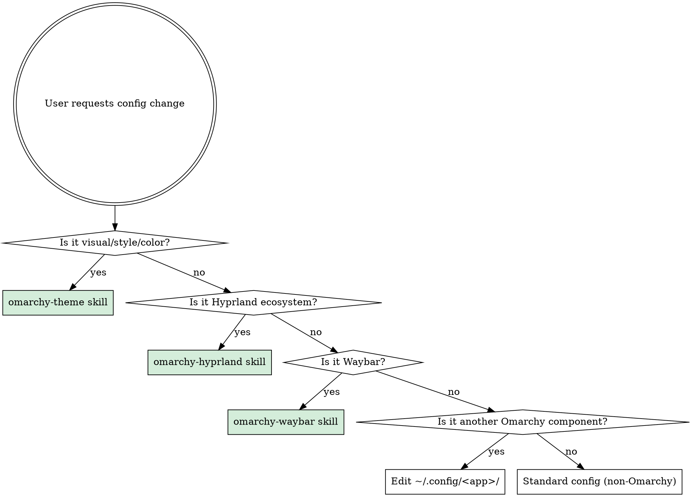

# Omarchy Env

Top-level environment navigator. Classifies config changes and routes to the correct skill to prevent wrong-layer edits.

## Step 0: Discover Environment (once per session)

Run these commands to establish context:

```bash
# Active theme slug
cat ~/.config/omarchy/current/theme.name

# Framework base path
echo ${OMARCHY_PATH:-~/.local/share/omarchy}

# Check if target file is a symlink (detect dotfiles repo)
readlink -f <target-file>
```

Cache these values mentally for the session. Do not re-run every question.

## Step 1: Classify the Change



### Category Definitions

| Category | Matches | Route to |
|----------|---------|----------|
| **A — Theme** | Colors, backgrounds, component styling, border colors, terminal colors, notification colors, bar opacity, accent color | `omarchy-theme` skill |
| **B — Hyprland** | Keybindings, monitors, input, window rules, animations, blur, opacity, tearing, idle, lock, sunset, autostart, env vars | `omarchy-hyprland` skill |
| **C — Waybar** | Bar modules, layout, module order, indicators, clock format, battery display, bar position/height | `omarchy-waybar` skill |
| **D — Other Omarchy** | Walker behavior, mako behavior (not colors), swayosd behavior (not colors) | Edit `~/.config/<app>/` directly |
| **E — Non-Omarchy** | Neovim plugins, shell, git, tmux, Docker, editors | Standard config location |

**Gray zone — Waybar colors**: This is Category A (theme), NOT Category C. Waybar colors live in the theme's `waybar.css`, not in `~/.config/waybar/style.css`.

## Step 2: Check for Alternatives

Before editing any component config, check if multiple apps serve the same function:
- **Invoke the `omarchy-alternatives` skill** if the component has known alternatives (launchers, terminals, notification daemons, browsers, file managers).
- If only one is installed, proceed. If multiple, ask the user.

## Step 3: Identify Correct File

### Component-to-File Mapping

| Component | Config file(s) | Notes |
|-----------|----------------|-------|
| Hyprland core | `~/.config/hypr/*.conf` | See `omarchy-hyprland` for split |
| Hyprlock | `~/.config/hypr/hyprlock.conf` | Sources theme colors at top |
| Hypridle | `~/.config/hypr/hypridle.conf` | No theme dependency |
| Hyprsunset | `~/.config/hypr/hyprsunset.conf` | No theme dependency |
| Waybar structure | `~/.config/waybar/config.jsonc` | Modules, order, settings |
| Waybar layout CSS | `~/.config/waybar/style.css` | Fonts, spacing, sizing |
| Waybar colors | Theme's `waybar.css` | Via `omarchy-theme` skill |
| Walker | `~/.config/walker/config.toml` | Behavior config |
| Walker colors | Theme's `walker.css` | Via `omarchy-theme` skill |
| Mako behavior | `~/.config/mako/config` | Check if symlink first |
| Mako colors | Theme's `mako.ini` | Via `omarchy-theme` skill |
| SwayOSD colors | Theme's `swayosd.css` | Via `omarchy-theme` skill |
| Terminal colors | Theme's `<terminal>.toml/conf` | Via `omarchy-theme` skill |

### Symlink Detection

Before editing any file:

```bash
readlink -f <file>
```

If the resolved path is inside `~/.config/omarchy/current/theme/` — **STOP**. That file is auto-generated. Edit the source in the user theme directory instead.

### NEVER-EDIT Zones

| Path | Why |
|------|-----|
| `~/.local/share/omarchy/` | Pacman-managed framework files. Overwritten on update. |
| `~/.config/omarchy/current/theme/` | Auto-generated by `omarchy-theme-set`. Overwritten on every theme apply. |
| Any symlink pointing into `current/theme/` | Same as above — edit the theme source instead. |

## Step 4: Fetch Docs

For upstream documentation on the component being modified:

```
# Context7 protocol
mcp__context7__resolve-library-id { "libraryName": "<component>" }
mcp__context7__query-docs { "libraryId": "<id>", "topic": "<specific topic>" }

# Omarchy Manual
Use omarchy-docs MCP tools (search_docs, read_section)
```

## Step 5: Post-Modification

| Change type | Action required |
|-------------|----------------|
| Theme file (`colors.toml`, theme CSS, etc.) | `omarchy-theme-set "$(cat ~/.config/omarchy/current/theme.name)"` |
| Hyprland conf (`~/.config/hypr/*.conf`) | Auto-reloads (Hyprland watches these files) |
| Waybar config/style | `omarchy-restart-waybar` |
| Mako config | `omarchy-restart-mako` |
| SwayOSD config | `omarchy-restart-swayosd` |
| Walker config | `omarchy-restart-walker` |
| Terminal config | `omarchy-restart-terminal` |
| btop config | `omarchy-restart-btop` |

## Step 6: Commit Protocol

```bash
# Find the repo root for the file you edited
git -C "$(dirname "$(readlink -f <file>)")" rev-parse --show-toplevel
```

- **Verify** the repo root is the EXPECTED repository before committing.
- If the file is symlinked from a dotfiles repo, commit in the dotfiles repo.
- If the file is in `~/.config/omarchy/themes/`, check if that directory is git-tracked or symlinked.
- **NEVER** commit to a nested clone, framework repo, or wrong repo by accident.

## Rules

- **ALWAYS discover the environment** (Step 0) before making any Omarchy config change.
- **ALWAYS classify** the change before touching files. The category determines the skill and the correct file.
- **NEVER edit files in NEVER-EDIT zones.** If `readlink -f` points there, find the real source.
- **NEVER hardcode paths** with `/home/<user>/`. Use `$HOME`, `~`, `$OMARCHY_PATH`, or dynamic discovery.
- **ALWAYS verify repo root** before committing. Wrong-repo commits are the most common and most damaging mistake.
