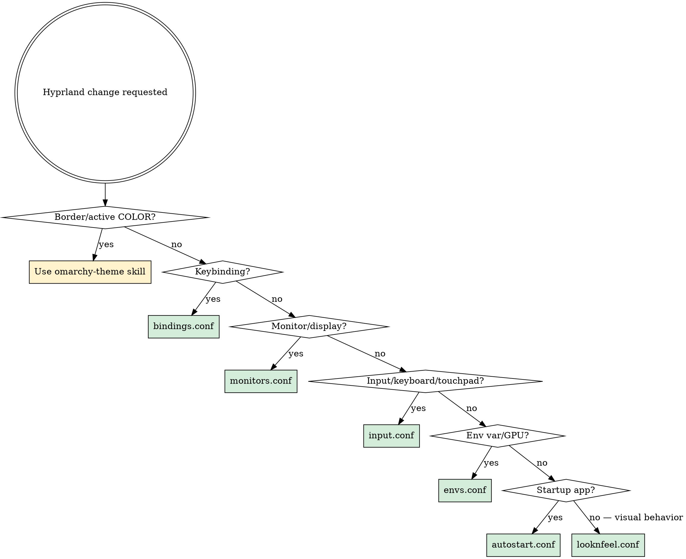

# Omarchy Hyprland

Map of the Hyprland ecosystem within Omarchy — what each config controls, where to edit, and what NOT to touch.

## The Config Chain

Hyprland sources configs in this order (later entries override earlier ones):

```
 1. ~/.local/share/omarchy/default/hypr/autostart.conf       NEVER EDIT (framework)
 2. ~/.local/share/omarchy/default/hypr/bindings/*.conf       NEVER EDIT (framework)
 3. ~/.local/share/omarchy/default/hypr/envs.conf             NEVER EDIT (framework)
 4. ~/.local/share/omarchy/default/hypr/looknfeel.conf        NEVER EDIT (framework)
 5. ~/.local/share/omarchy/default/hypr/input.conf            NEVER EDIT (framework)
 6. ~/.local/share/omarchy/default/hypr/windows.conf          NEVER EDIT (framework)
 7. ~/.config/omarchy/current/theme/hyprland.conf             NEVER EDIT (theme-generated)
 8. ~/.config/hypr/monitors.conf                              USER OVERRIDE
 9. ~/.config/hypr/input.conf                                 USER OVERRIDE
10. ~/.config/hypr/bindings.conf                              USER OVERRIDE
11. ~/.config/hypr/envs.conf                                  USER OVERRIDE
12. ~/.config/hypr/looknfeel.conf                             USER OVERRIDE
13. ~/.config/hypr/autostart.conf                             USER OVERRIDE
```

**User files source LAST** — they override everything above. Edit files 8–13 only.

## User Config Files — What Goes Where

| File | Purpose | Examples |
|------|---------|---------|
| `monitors.conf` | Display layout | Resolution, position, scale, refresh rate, VRR per monitor |
| `input.conf` | Input devices | Keyboard layout, repeat rate, touchpad, sensitivity, `kb_options` |
| `bindings.conf` | Keybindings | `bindd = MODS, KEY, Description, action, args` |
| `envs.conf` | Environment variables | GPU vars, input method, cursor vars |
| `looknfeel.conf` | Visual behavior | Gaps, borders, rounding, blur, opacity, animations, tearing, VRR, cursor, window rules, layer rules |
| `autostart.conf` | Startup apps | `exec-once = uwsm app -- <command>` |
| `workspaces.conf` | Workspace rules | Monitor assignments, special workspaces |

## Decision Tree



## Theme vs User Boundary

| Aspect | Owner | File |
|--------|-------|------|
| Border/active color | **Theme** | Theme's `hyprland.conf` (from `colors.toml` accent) |
| Gaps, rounding, border width | **User** | `looknfeel.conf` |
| Blur, opacity, animations | **User** | `looknfeel.conf` |
| Tearing, VRR | **User** | `looknfeel.conf` |
| Window rules, layer rules | **User** | `looknfeel.conf` |
| Cursor behavior | **User** | `looknfeel.conf` |

**Rule**: Border/active COLOR = theme. Everything behavioral = user.

## Companion Tools

| Tool | Config file | Theme dependency | Notes |
|------|------------|-----------------|-------|
| **Hyprlock** | `~/.config/hypr/hyprlock.conf` | YES | `source = ~/.config/omarchy/current/theme/hyprlock.conf` at top provides color vars (`$color`, `$inner_color`, etc.). Edit structure/layout below the source line. |
| **Hypridle** | `~/.config/hypr/hypridle.conf` | NO | Idle timeouts, lock triggers, DPMS |
| **Hyprsunset** | `~/.config/hypr/hyprsunset.conf` | NO | Night light profiles, temperature |
| **Hyprctl** | CLI (no config) | NO | `hyprctl dispatch`, `hyprctl keyword`, `hyprctl clients`, `hyprctl reload` |

## Omarchy Defaults Reference

To see what defaults you're overriding:

```bash
cat ${OMARCHY_PATH:-~/.local/share/omarchy}/default/hypr/<file>.conf
```

Key defaults:
- **looknfeel**: gaps 5/10, border 2, rounding 0, dwindle layout, animations on, blur size 2 passes 2
- **bindings**: SUPER+RETURN=terminal, SUPER+F=file manager, SUPER+B=browser, SUPER+N=neovim, SUPER+T=btop
- **input**: us layout, compose:caps, natural_scroll=false
- **windows**: 0.97/0.9 opacity on `default-opacity` tagged windows

## Context7 Integration

```
mcp__context7__resolve-library-id { "libraryName": "hyprland" }
mcp__context7__query-docs { "libraryId": "<id>", "topic": "<specific topic>" }
```

Useful topics: `window rules`, `layer rules`, `animations`, `variables`, `keywords`, `monitors`, `binds`, `hyprlock`, `hypridle`

## Common Tasks Cheat Sheet

| Task | File | Syntax |
|------|------|--------|
| Add keybinding | `bindings.conf` | `bindd = MODS, KEY, Description, exec, command` |
| Change opacity | `looknfeel.conf` | `windowrule = opacity X Y, <match>` |
| Add blur to layer | `looknfeel.conf` | `layerrule = blur, <namespace>` |
| Change monitor | `monitors.conf` | `monitor = <name>, <res>@<hz>, <pos>, <scale>` |
| Add autostart app | `autostart.conf` | `exec-once = uwsm app -- <command>` |
| Lock screen layout | `hyprlock.conf` | Edit structure below `source` line |
| Idle timeouts | `hypridle.conf` | Modify `listener` blocks |
| Night light | `hyprsunset.conf` | Add/modify profile blocks |

## Post-Modification

| What changed | Action |
|-------------|--------|
| Any `~/.config/hypr/*.conf` | **Auto-reloads** — Hyprland watches these files |
| Hyprlock/Hypridle | Changes apply on next lock/idle cycle |
| Force reload | `hyprctl reload` |
| Test lock screen | `omarchy-lock-screen` |
| Border colors (theme) | `omarchy-theme-set "$(cat ~/.config/omarchy/current/theme.name)"` |

## Rules

- **NEVER edit** files 1–7 in the config chain. User overrides are files 8–13 ONLY.
- **NEVER edit** `~/.config/omarchy/current/theme/hyprland.conf` — it is regenerated by theme-set.
- **Border colors** are a theme concern. Use the `omarchy-theme` skill for color changes.
- **All behavioral settings** (gaps, blur, opacity, animations, tearing, window rules) go in `looknfeel.conf`.
- **Autostart commands** must use `uwsm app --` prefix for proper session management.
- **Bindings use `bindd`** (with description) in Omarchy — not plain `bind`.
