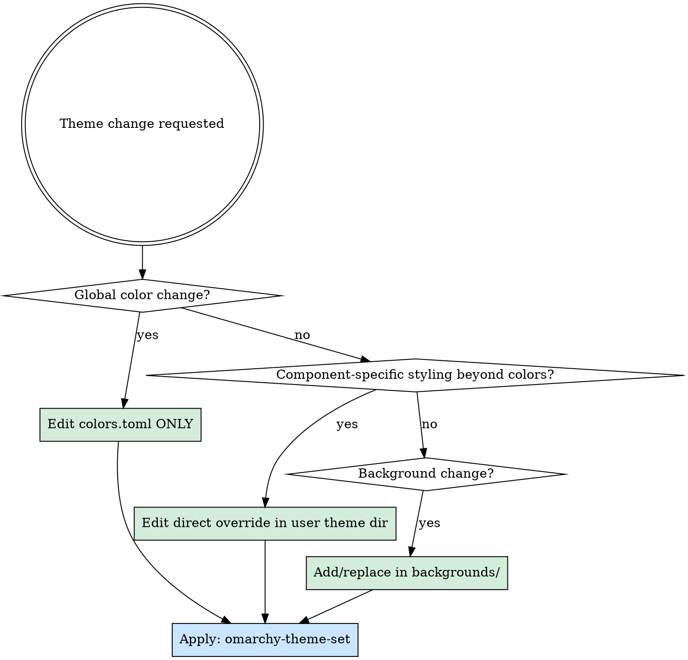

# Omarchy Theme

Full protocol for working within the Omarchy theme system. Prevents the most common mistakes: editing generated files, editing the wrong layer, and forgetting to apply.

## Step 0: Discover Theme Context

```bash
# Theme slug
THEME_SLUG=$(cat ~/.config/omarchy/current/theme.name)

# User theme dir (what you edit)
ls ~/.config/omarchy/themes/$THEME_SLUG/

# Built-in theme dir (never edit)
ls ${OMARCHY_PATH:-~/.local/share/omarchy}/themes/$THEME_SLUG/ 2>/dev/null

# Active assembled theme (never edit — generated output)
ls ~/.config/omarchy/current/theme/
```

## Architecture: How `omarchy-theme-set` Works

```
1. Copy built-in theme files    → next-theme/
2. Overlay user theme files      → next-theme/  (overwrites built-in)
3. Generate from templates       → next-theme/  (ONLY if file doesn't already exist)
4. Atomic swap                   → current/theme/
5. Restart all components + set app themes + run hooks
```

**Key insight**: Placing a file in the user theme directory **suppresses** template generation for that component. The file you provide is used as-is.

## Template System

- Templates live at `${OMARCHY_PATH:-~/.local/share/omarchy}/default/themed/*.tpl`
- User can override templates at `~/.config/omarchy/themed/*.tpl`
- Placeholders from `colors.toml`:

| Placeholder | Output | Example (if accent = `#aabbcc`) |
|-------------|--------|---------|
| `{{ accent }}` | Raw value | `#aabbcc` |
| `{{ accent_strip }}` | Hex without `#` | `aabbcc` |
| `{{ accent_rgb }}` | Decimal R,G,B | `170, 187, 204` |

- Available keys: `accent`, `cursor`, `foreground`, `background`, `selection_foreground`, `selection_background`, `color0`–`color15`
- **ALWAYS read the user's actual `colors.toml`** to get real values. Never assume or reuse example colors.

## What to Edit — Decision Tree



- **Global color change** (accent, background, foreground, etc.): Edit `colors.toml` only. Templates propagate to all components that don't have direct overrides.
- **Component-specific styling** (layout, spacing, extra CSS rules): Create/edit a direct override file in the user theme dir.
- **Bootstrap a direct override**: `cp ~/.config/omarchy/current/theme/<file> ~/.config/omarchy/themes/$THEME_SLUG/<file>` — then edit the copy.

## Theme File Reference

| File | Component | Has template? | Notes |
|------|-----------|--------------|-------|
| `colors.toml` | ALL | N/A (source) | Required for template generation |
| `waybar.css` | Waybar colors | Yes | `@define-color` vars; imported by user's `style.css` |
| `hyprland.conf` | Hyprland borders | Yes | Sets `col.active_border` from accent |
| `hyprlock.conf` | Lock screen colors | Yes | Color variables using `_rgb` suffix |
| `mako.ini` | Notifications | Yes | Colors + default behavior |
| `swayosd.css` | Volume/brightness OSD | Yes | CSS `@define-color` |
| `walker.css` | App launcher colors | Yes | CSS `@define-color` |
| `alacritty.toml` | Alacritty terminal | Yes | Full TOML color config |
| `ghostty.conf` | Ghostty terminal | Yes | Key=value colors |
| `kitty.conf` | Kitty terminal | Yes | Key=value colors |
| `btop.theme` | System monitor | Yes | btop theme format |
| `chromium.theme` | Browser theme | Yes | JSON-like |
| `obsidian.css` | Obsidian notes | Yes | CSS variables |
| `neovim.lua` | Neovim colorscheme | **No** | Must provide directly |
| `vscode.json` | VS Code theme | **No** | Maps to extension ID |
| `icons.theme` | Icon theme name | **No** | Plain text |
| `backgrounds/` | Wallpapers | **No** | Image files, cycled by `omarchy-theme-bg-next` |
| `preview.png` | Theme preview | **No** | Shown by theme picker |

## Apply Protocol

**Always apply after any theme change:**

```bash
omarchy-theme-set "$(cat ~/.config/omarchy/current/theme.name)"
```

- Do NOT manually restart individual components — `omarchy-theme-set` handles all restarts, app theme setting, and hook execution.
- Background cycling: `omarchy-theme-bg-next`, `omarchy-theme-bg-set <path>`

## Git/Commit Protocol

```bash
THEME_SLUG=$(cat ~/.config/omarchy/current/theme.name)
THEME_DIR=~/.config/omarchy/themes/$THEME_SLUG

# Check if theme dir is in a git repo
git -C "$THEME_DIR" rev-parse --show-toplevel 2>/dev/null

# If symlinked, find the real repo
git -C "$(dirname "$(readlink -f "$THEME_DIR/colors.toml")")" rev-parse --show-toplevel 2>/dev/null
```

- If git-tracked, commit in that repo.
- If symlinked, commit in the symlink target's repo.
- **ALWAYS verify repo root before committing.**

## Common Mistakes to Prevent

| Mistake | Why it's wrong | Correct action |
|---------|---------------|----------------|
| Editing `~/.config/waybar/style.css` for colors | Colors come from theme's `waybar.css` | Edit `~/.config/omarchy/themes/$THEME_SLUG/waybar.css` |
| Editing `~/.config/mako/config` directly | May be symlink to generated theme output | Check `readlink -f`, edit theme's `mako.ini` for colors |
| Editing `~/.config/omarchy/current/theme/*` | Overwritten on every `omarchy-theme-set` | Edit user theme dir instead |
| Creating direct override when `colors.toml` suffices | Wastes effort, blocks future color changes from propagating | Only override when you need non-color styling |
| Forgetting `omarchy-theme-set` after changes | Changes sit in theme dir but aren't assembled/applied | Always run apply command |
| Hardcoding `/home/<user>/` in paths | Breaks for other users | Use `$HOME`, `~`, `$OMARCHY_PATH`, dynamic discovery |

## Rules

- **NEVER edit `~/.config/omarchy/current/theme/`** — it is regenerated on every theme apply.
- **NEVER edit `~/.local/share/omarchy/themes/`** — it is managed by pacman.
- **Prefer `colors.toml`** for color-only changes. Only create direct overrides when you need layout/structural changes.
- **Always apply** with `omarchy-theme-set` after modifications.
- **Always verify** which repo you're committing to.
