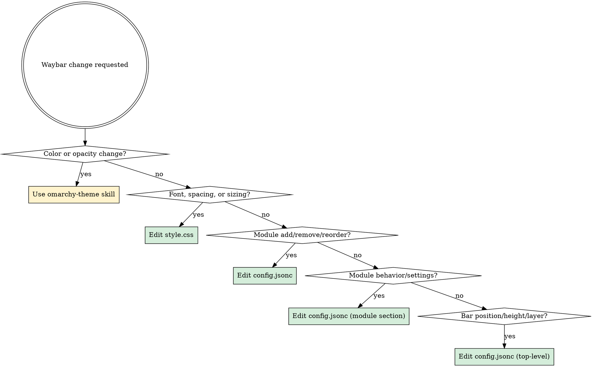

# Omarchy Waybar

Waybar has a critical split-layering model across three files in two ownership domains. This skill prevents the #1 mistake: editing `style.css` for color changes.

## The Split-Layer Model

| File | Owner | Controls |
|------|-------|----------|
| `~/.config/omarchy/themes/$THEME_SLUG/waybar.css` | **Theme** | Color definitions (`@define-color`), bar background color/opacity |
| `~/.config/waybar/style.css` | **User** | Font, spacing, module sizing, layout CSS |
| `~/.config/waybar/config.jsonc` | **User** | Modules, their order, module settings, bar position, height, layer |

**`style.css` imports theme colors** via `@import "../omarchy/current/theme/waybar.css"` at line 1.

## Decision Tree



**CRITICAL RULE**: Need to change colors or opacity? That's a theme change — use the `omarchy-theme` skill. Do NOT edit `style.css` for this.

## Omarchy Default Waybar Reference

To see the defaults you may be overriding:

```bash
# Default module config
cat ${OMARCHY_PATH:-~/.local/share/omarchy}/config/waybar/config.jsonc

# Default styling
cat ${OMARCHY_PATH:-~/.local/share/omarchy}/config/waybar/style.css

# Omarchy indicator scripts
ls ${OMARCHY_PATH:-~/.local/share/omarchy}/default/waybar/indicators/
```

## config.jsonc Structure

- Top bar and bottom bar defined as array: `[{ top bar }, { bottom bar }]`
- Each bar object has: `position`, `height`, `layer`, `modules-left`, `modules-center`, `modules-right`
- Has `"reload_style_on_change": true` — CSS-only changes auto-reload

### Omarchy Custom Modules

| Module | Purpose |
|--------|---------|
| `custom/omarchy` | Omarchy menu button |
| `custom/update` | Update indicator |
| `custom/voxtype` | Voice typing indicator |
| `custom/screenrecording-indicator` | Screen recording status |
| `custom/idle-indicator` | Idle inhibitor status |
| `custom/notification-silencing-indicator` | Notification silence status |

### Standard Modules

`hyprland/workspaces`, `hyprland/window`, `clock`, `battery`, `pulseaudio`, `bluetooth`, `network`, `cpu`, `tray`

## style.css Structure

- **Line 1**: `@import "../omarchy/current/theme/waybar.css";` — **NEVER remove this import**
- `*` selector: sets `background-color: @background`, `color: @foreground`, font family/size
- Module-specific selectors: `#clock`, `#battery`, `#workspaces button`, etc.
- Bottom bar selectors: `window#waybar.bottom`

## Theme waybar.css Structure

```css
@define-color foreground <hex>;
@define-color background rgba(R, G, B, ALPHA);   /* alpha controls bar transparency */

window#waybar { background-color: rgba(...); }
window#waybar * { background-color: transparent; }  /* modules inherit bar bg */
```

## Context7 Integration

```
mcp__context7__resolve-library-id { "libraryName": "waybar" }
mcp__context7__query-docs { "libraryId": "<id>", "topic": "<module name or feature>" }
```

Useful topics: module names (e.g., `clock`, `battery`, `custom`), `styling`, `configuration`

## Post-Modification

| What changed | Action |
|-------------|--------|
| `style.css` only | Auto-reloads (if `reload_style_on_change` is true) |
| `config.jsonc` | `omarchy-restart-waybar` |
| Theme's `waybar.css` | `omarchy-theme-set "$(cat ~/.config/omarchy/current/theme.name)"` |

## Rules

- **NEVER edit `style.css` for color changes.** Colors are defined in the theme's `waybar.css`.
- **NEVER remove the `@import` line** at the top of `style.css`.
- **NEVER edit `~/.config/omarchy/current/theme/waybar.css`** — it is regenerated. Edit the source in the user theme directory.
- **Use `@define-color` variable names** (e.g., `@foreground`, `@background`) in `style.css` when referencing theme colors — not raw hex values.
- After structural changes (`config.jsonc`), run `omarchy-restart-waybar`.
